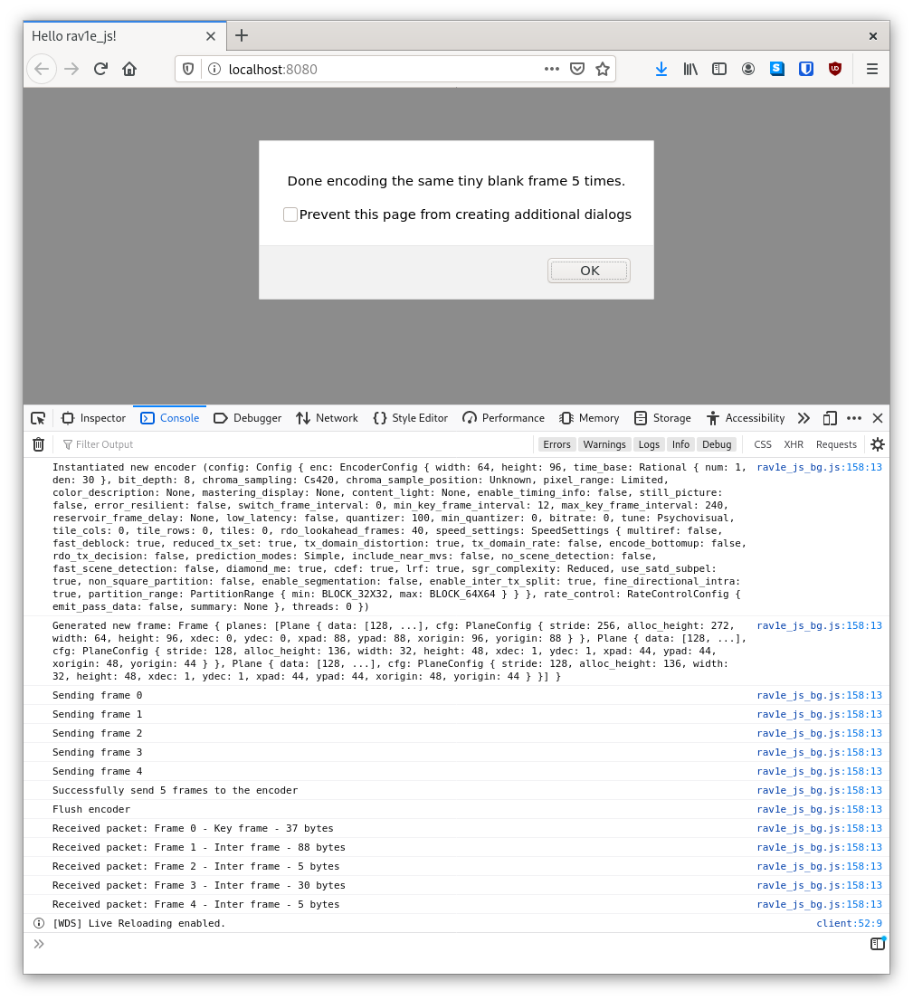
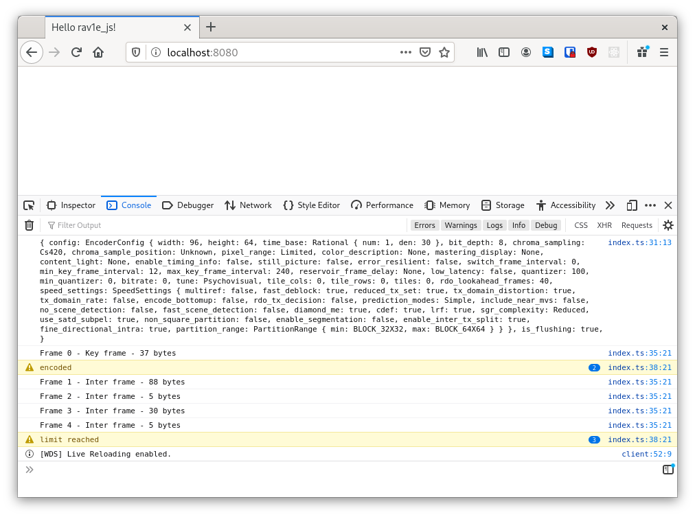

# Google Summer of Code 2020 - First month

I am very happy to be part of the GSoC 2020 at Mozilla to support [`rav1e`](https://github.com/xiph/rav1e) "The fastest and safest AV1 encoder".

**Table of Contents**
- [rav1e](#rav1e)
  - [Video encoder](#video-encoder)
  - [AV1](#av1)
  - [Rust](#rust)
- [My project](#my-project)
  - [Steps to achieve this](#steps-to-achieve-this)
- [My journey (so far)](#my-journey-so-far)
  - [Getting comfortable](#getting-comfortable)
  - [Proof of concept](#proof-of-concept)
  - [JsApi v0.1](#jsapi-v01)
    - [Goal](#goal)
    - [Design](#design)
    - [Implementation](#implementation)
      - [Rust](#rust-1)
      - [JavaScript](#javascript)
      - [Website](#website)
  - [Next steps](#next-steps)
- [Mentors](#mentors)
- [Citations](#citations)

## rav1e
The most important thing first: The name is an abbreviation for "rust AV1 encoder".

As the name suggests rav1e is a video encoder for the [AV1 video coding format](https://en.wikipedia.org/wiki/AV1), written in [rust](https://www.rust-lang.org/).

### Video encoder
Simply spoken a video encoder takes uncompressed video as an input, compresses it and outputs a video way tinier in size. This output is handier than the input and can be for example saved to disk or distributed over the network. Later it can be decompressed using a video decoder (e.g. [`dav1d`](https://code.videolan.org/videolan/dav1d)) to get back to the original video quality.

Under the hood it is very complex from a mathematical and software engineering perspective, but to be honest I don't fully get it yet.

### AV1
> AOMedia Video 1 [...] is an open, royalty-free video coding format designed for video transmissions over the Internet. It was developed [...] by the Alliance for Open Media (AOMedia), a consortium founded in 2015 that includes semiconductor firms, video on demand providers, video content producers, software development companies and web browser vendors.
> [⁽¹⁾](#citations)

Mozilla is a governing member of AOMedia.

### Rust
"Rust is a multi-paradigm programming language focused on performance and safety" [⁽²⁾](#citations).

It is actually one reason I choose to apply for this project, because I think I can learn a programming language best by applying it in a meaningful real world project.

## My project
The goal of [my project](https://summerofcode.withgoogle.com/projects/#5943470990032896) is to enable and improve [`webassembly (wasm)`](https://webassembly.org/) support for rav1e, mainly to make it usable as an in-browser encoder. This might be useful for video conferencing or web-based video capturing / editing products.

### Steps to achieve this
1. Build a JavaScript/TypeScript API for rav1e _(well documented and tested, of course 😉)_
2. Profile rav1e running on webassembly (size and time)
3. Improve wasm target based on profiling
4. Provide demo applications for various platforms (vanilla js/ts, [node.js](https://nodejs.org/), [react.js](https://reactjs.org/), [yew](https://github.com/yewstack/yew), [deno](https://github.com/denoland/deno))

## My journey (so far)

### Getting comfortable
([`#2328`](https://github.com/xiph/rav1e/pull/2328), [`#2344`](https://github.com/xiph/rav1e/pull/2344))

Before starting to work on my actual project, I familiarized myself with the codebase, community and the overall domain of video processing. To do so I took on some small issues (`#2328`, `#2344`) and read a lot about video encoding. I got good feedback to my PRs on GitHub and also on IRC. Already in that stage I noticed how responsive and willing to help the rav1e contributors are.

### Proof of concept
([`#2382`](https://github.com/xiph/rav1e/pull/2382))

The next step was a proof of concept for the JsApi. I am building it with [`wasm-bindgen`](https://github.com/rustwasm/wasm-bindgen).

`wasm-bindgen` lets you:
> Facilitat[e] high-level interactions between Wasm modules and JavaScript [and] [i]mport JavaScript things into Rust and export Rust things to JavaScript.
> [⁽³⁾](#citations)

In the background rust gets compiled to wasm (`--target wasm32-unknown-unknown`). Additionally wasm-bindgen creates functionality to pass data across the wasm-ABI and also adds bindings for JavaScript. This makes it possible to control everything from the JS side, but still do the heavy lifting with somewhat native performance on the wasm side.

This first version only exposes one function `simple_encoding(repeats: u32)`. It instantiates an encoder, feeds it multiple blank frames, encodes them and logs the received packets. <br>

Find the actual implementation in `#2382` and a simplified version following:

**Rust**
```rust
#[wasm_bindgen]
fn simple_encoding(repeats: u32) {
    // this is our encoder
    let ctx: Context<u16> = Config::new()
        .with_encoder_config(EncoderConfig::default())
        .new_context().unwrap();

    // let's send multiple blank frames to the encoder
    let f: Frame<u16> = ctx.new_frame();
    for i in 0..repeats {
        ctx.send_frame(f.clone()).unwrap();
    }

    // we tell the encoder, that we are done sending input
    ctx.flush()

    // and now we encode all frames and log the received packets
    loop {
        match ctx.receive_packet() {
            Ok(packet) => log!("Received packet: {}", packet),
            Err(EncoderStatus::Encoded) => {}
            Err(EncoderStatus::LimitReached) => break,
            Err(e) => panic!(e);
        }
    }
}
```

**JavaScript**
```ts
import { simple_encoding } from "rav1e";

// encodes 5 frames
simple_encoding(5);
```

**Website**


Also the PR introduces some checks for the CI.

### JsApi v0.1
([`#2399`](https://github.com/xiph/rav1e/pull/2399), [`lu-zero/noop_proc_macro#3`](https://github.com/lu-zero/noop_proc_macro/pull/3))

After the proof of concept landed, I sat on designing and implementing `v0.1` of the actual API.

#### Goal
The goal was to rebuild the functionality of `simple_encoding(...)`, but controlled from the JS side.

#### Design
As suggested by `lu_zero` I started by researching existing encoder APIs. The goal was to build a familiar interface users feel comfortable with.

Find the results of the research [on notion](https://www.notion.so/urhengulas/API-Design-0dfc787efe4649ac9d2fae45d1e8ff84).

During my research, I firstly noticed that there are not that many media encoders in JavaScript and often they are "just" wrapper around encoding tools (e.g. [`ffmpeg`](https://ffmpeg.org/ffmpeg.html) (written in C/C++)). One main reason for that is probably the high computing power encoders demand, which are not exactly given by interpreted languages like JavaScript.

**fluent-ffmpeg**

The API I think is best to take as a role model is [`fluent-ffmpeg`](https://github.com/fluent-ffmpeg/node-fluent-ffmpeg) (only works in node.js with ffmpeg present).

What I like about it:
* configuration via trailable methods
* event handlers like 'progress' (transcoding progress information), or 'end' (processing finished)
* multiple ways to put your data in (uploaded file, `fs.ReadStream` )

**fluent-ffmpeg example**
```ts
const enc: FfmpegCommand = ffmpeg('/path/to/your_movie.avi')
  // video options
  .videoBitrate(1024).videoCodec('divx').aspect('16:9')
  .size('50%')       .fps(24)
  // audio options
  .noAudio()
  // output options
  .format('avi')
  // event handler
  .on('end', function() {
    console.log('file has been converted succesfully');
  })
  .on('error', function(err) {
    console.log('an error happened: ' + err.message);
  });

const outStream = fs.createWriteStream('/path/to/output.avi');

// start processing and write to stream
enc.pipe(outStream, {end: true});
```

**ffmpeg.wasm**

Another noteworthy one is [`ffmpeg.wasm`](https://github.com/ffmpegwasm/ffmpeg.wasm), which is a bit similar to what the goal of my project is. It's a JS library based on webassembly (ports ffmpeg from C/C++, via [emscripten](https://emscripten.org/)).

#### Implementation
As I said before the API is built with `wasm-bindgen`.

Just exposing the existing rav1e-API sadly doesn't work, because as of today wasm-bindgen doesn't support rust generics. The rav1e API uses [`trait v_frame::pixel::Pixel`](https://docs.rs/v_frame/0.1.0/v_frame/pixel/trait.Pixel.html) for types which can be used as a pixel of the frames. Currently these are `u8` and `u16`.

Because of this, and also because there are different requirements for the rust and JavaScript APIs, I decided to go for wrapping the needed structs into custom structs and implementing the desired methods on them.

Let's revisit our encoding example from before and have a look what v0.1 looks like:

_(Note: I simplified and stripped for better understanding)_

##### Rust

**EncoderConfig**
```rust
/// Encoder settings which impact the produced bitstream.
#[wasm_bindgen]
pub struct EncoderConfig {
  conf: rav1e::api::config::encoder::EncoderConfig,
}
#[wasm_bindgen]
impl EncoderConfig {
  #[wasm_bindgen(constructor)]
  pub fn new() -> Self {
    EncoderConfig { conf: Rav1eEncoderConfig::default() }
  }

  /// Width and height of the frames in pixels.
  pub fn setDim(&mut self, width: usize, height: usize) -> Self {
    self.conf.height = height;
    self.conf.width = width;
    self.clone()
  }

  // ...
}
```
Let's explain a bit what's going on here.

The function annotated with `#[wasm_bindgen(constructor)]` will be called if you are running `new EncoderConfig()` on the JS side. In this case we are returning the default configuration.

Next, one can configure the encoder by calling one of various methods like `setDim(...)`. What's actually interesting about this is the function signature. Because we have `&mut self` and return `Self` (by calling `self.clone()`) we enable trailing the methods, but without invalidating the object the method is called on.

**Frame and Packet**
```rust
/// Represents one video frame.
pub struct Frame {
  f: v_frame::frame::Frame<u16>,
}

/// A packet contains one shown frame together with zero or more additional frames.
pub struct Packet {
  p: rav1e::api::util::Packet<u16>,
}
```
Not much interesting going on here. These are only needed because of the lacking support for generics in wasm-bindgen.

**Encoder**
```rust
/// Contains the encoding state.
#[wasm_bindgen]
pub struct Encoder {
  ctx: rav1e::api::context::Context<u16>,
}
#[wasm_bindgen]
impl Encoder {
  #[wasm_bindgen(constructor)]
  pub fn fromEncoderConfig(conf: EncoderConfig) -> Result<Encoder, JsValue> {
    let cfg = Config::new().with_encoder_config(conf.conf);

    match cfg.new_context() {
      Ok(c) => Ok(Encoder { ctx: c }),
      Err(e) => Err(construct_js_err(e, "Invalid EncoderConfig")),
    }
  }

  /// Allocates and returns a new frame.
  pub fn newFrame(&self) -> Frame {
    Frame { f: self.ctx.new_frame() }
  }

  // ...
}
```
What might be interesting here is the `-> Result<Encoder, JsValue>`. Because `cfg.new_context()` might yield an error (if `EncoderConfig` is invalid) we can return an error as a `JsValue`. If everything goes fine we are returning the `Encoder`. This enables basic error-handling on the JS side.

Also notice that we need to wrap the return value of `ctx.new_frame()` in our own `Frame` to return it to JS.

##### JavaScript
And that is how it looks from a JS-user perspective:
```ts
import { ChromaSamplePosition, Encoder, EncoderConfig, Frame, Packet } from "rav1e";

// this is our encoder
const enc: Encoder = new Encoder(new EncoderConfig()
    .setDim(96, 64)
    .setSpeed(9)
    .setChromaSamplePosition(ChromaSamplePosition.Unknown)
);

// let's send 10 blank frames to the encoder
const f: Frame = enc.newFrame();
for (let i = 0; i < 10; i++) {
    enc.sendFrame(f);
}

// we tell the encoder, that we are done sending input
enc.flush();

// and now we encode all frames and log the received packets
for (let i = 0; i < 20; i++) {
    try {
        const p: Packet = enc.receivePacket();
        console.log(p.display())
    } catch (e) {
        console.warn(e);
    }
}
```

##### Website



Looks very familiar, doesn't it? The only difference  that JavaScript now is in control and not rust anymore.

### Next steps
That's what I achieved so far. Looking back it is actually a bit of progress towards the goal of rav1e supporting webassembly :)

The next steps will be:
* feeding custom data to the encoder _(aka. actually making the encoder useful)_
* profiling (speed and size, though focus will be on speed)
* keeping having fun

## Mentors
I want to give a special "Thank you ❤️!" to all the people supporting me in this little journey.

One person is my mentor for this project, Nathan Egge. He is [Video Codec Engineer at Mozilla](https://developer.mozilla.com/communities/people/nathan-egge/) and you can find him as [`negge` on GitHub](https://github.com/negge).

Additionally I get support by other rav1e supporters, especially noteworthy Luca Barbato ([`lu_zero` on GitHub](https://github.com/lu-zero)) and Vibhoothi ([`vibhoothiiaanand` on GitHub](https://github.com/vibhoothiiaanand), but else `mindfreeze`).

A big thank you to all of you 😊

## Citations
1. AV1. (2020, June 29). Retrieved June 30, 2020, from https://en.wikipedia.org/wiki/AV1
2. Rust (programming language). (2020, June 25). Retrieved June 30, 2020, from https://en.wikipedia.org/wiki/Rust_(programming_language)
3. Rustwasm. (2020, March 17). Rustwasm/wasm-bindgen. Retrieved June 30, 2020, from https://github.com/rustwasm/wasm-bindgen/blob/master/README.md