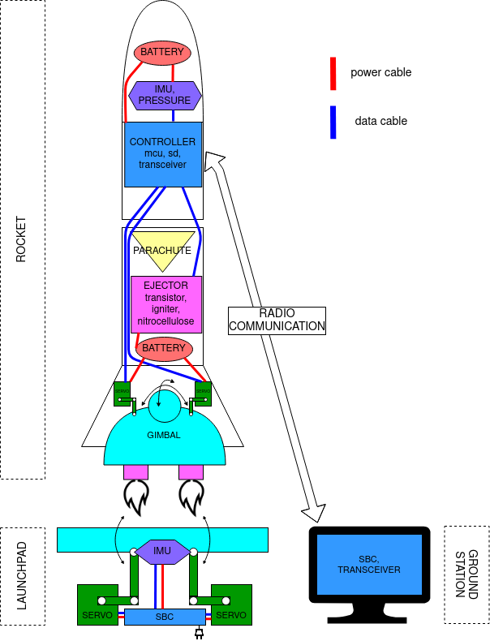

# Rocket from Scratch #1 – The fellowship of the rocket 🚀

"Rocket from Scratch 🚀" is the name of my university project during spring semester 2021. We are a team of 11 students (mostly software engineers, with one exceptional product manager 😉) and aim to send an actively stabilized model rocket up to 500 meters and transfer life data.

This is the first of a blog series of three posts. They are largely based on the "IoT Project Documentation" we did hand-in for our assessment in the module "SE_12 Internet of Things", which my team mates [`Brenden`], [`Lukas`] and myself wrote together.

[`Brenden`]: https://github.com/BMG93 
[`Lukas`]: https://github.com/m-lukas

This first part is giving an overview of the project and the whole system. In the second part we will showcase the control algorithm which guides our rocket through the states of the flight. We will conclude the series with reasoning about the design considerations which went into building the rocket. 

Let us get into it!

## System overview

As mentioned before, the technical goal of the “CODE Space Lab” is to build a custom model rocket, launch it to 500 meters in altitude and teach it to stabilize its flight using thrust-vector control. In addition, we want to transmit the sensor data and logs to a ground station during flight, giving a live overview of the system. A high-level visualisation of the rocket, launchpad and ground station can be seen in Image 2.

_Figure 1: High-level system overview_

## Team structure
...
