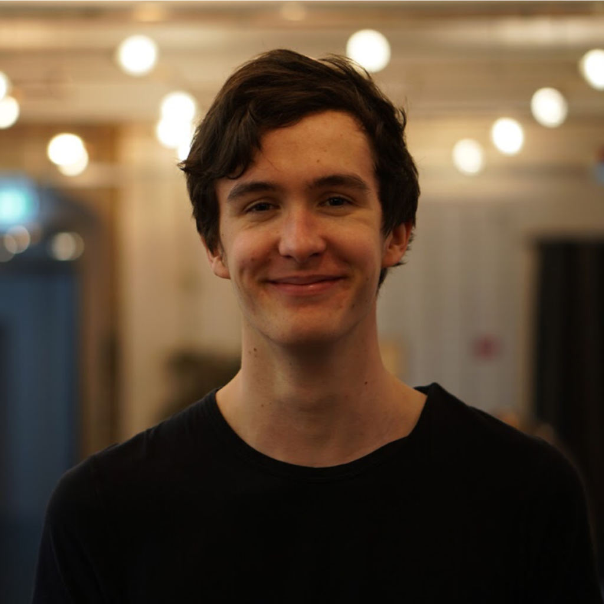

# me
Currently, I identify myself primarily as a software developer. I am interested in science, tech, politics and humans.

## facts

| attribute        | value                     |
| :--------------- | :------------------------ |
| name             | Johann Heinrich Hemmann   |
| birthday         | 12.02.2000                |
| centre of life   | Berlin, Germany           |
| origin town      | Weida, Thuringia, Germany |
| sex / gender     | cis-male                  |
| fluent languages | german (native), english  |

## various profiles

| platform          | link                                                                                     |
| :---------------- | :--------------------------------------------------------------------------------------- |
| GitHub            | [github.com/urhengulas](https://github.com/urhengulas)                                   |
| LinkedIN          | [linkedin.com/in/hemmann](https://linkedin.com/in/hemmann)                               |
| Twitter           | [twitter.com/urhengula5](https://twitter.com/urhengula5)                                 |
| League of Legends | [lolprofile.net/summoner/euw/Urhengulas](https://lolprofile.net/summoner/euw/Urhengulas) |

## books I like

| book          | author             |
| :------------ | :----------------- |
| Ach, Afrika   | Bartholomäus Grill |
| Ultralearning | Scott H. Young     |
